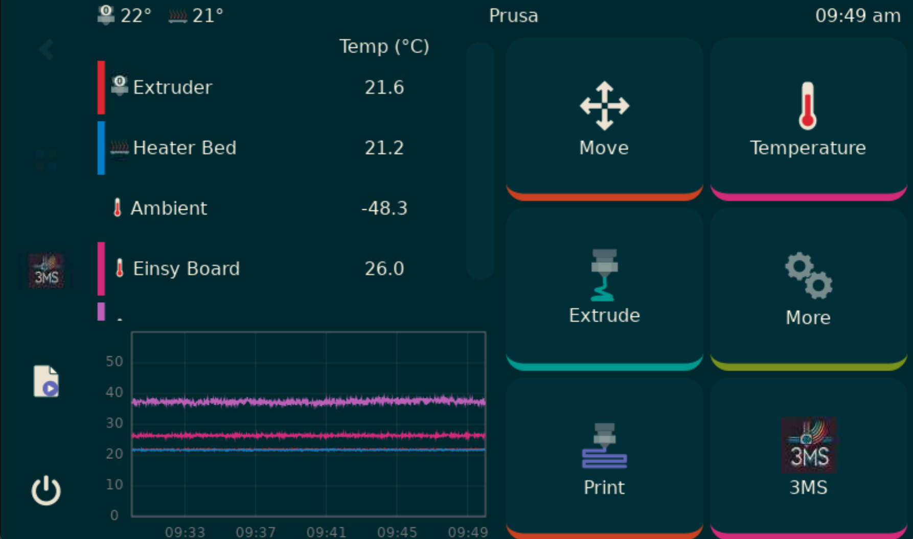
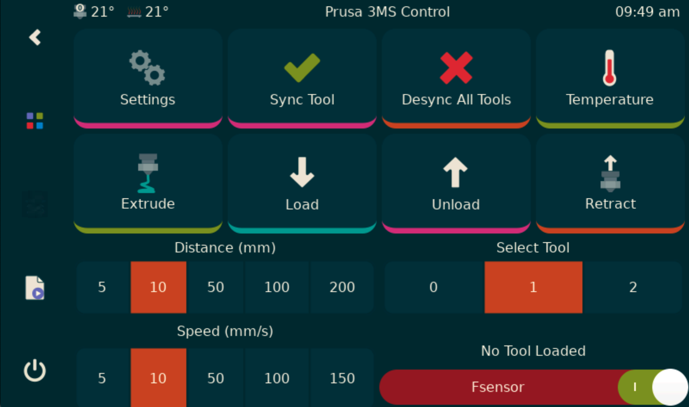

# KlipperScreen for 3MS

### NOTE

This fork of KlipperScreen is in a beta state.

---

KlipperScreen for 3MS is a fork of KlipperScreen designed for use with the [3MS](https://github.com/3DCoded/3MS) modular multimaterial system. This fork is also based on the [Happy Hare](https://github.com/moggieuk/KlipperScreen-Happy-Hare-Edition) fork of KlipperScreen.

## Screenshots

## Install

**BETA!**

See the [Documentation](https://3dcoded.github.io/3MS/setup/KlipperScreen).

---
